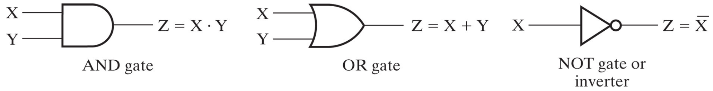

# [CHAPTER 3] COMBINATIONAL CIRCUITS 

## Boolean algebra and logic gates
- **Boolean algebra** is a mathematical system for specifying and transforming logic functions. It is used to design and analyze digital systems.
  boolean algebra revolves around binary variables (variables whose value can etheir be **true** or **false**) and the use of binary functions on them. \
- **Logic gates** are circuits that implements logic functions, a logic function is a function that takes 
one or several binary variables and returns one. Basical logical functions are **AND, OR, NOT**.
  - The **AND** function is denoted by a dot : (X**AND**Y) &rarr; (X•Y) or (XY).
  - The **OR** functions is denoted bu a plus : (X**OR**Y) &rarr; (X+Y).
  - The **NOT** is denoted by an overbar or a !: (**NOT** X) &rarr; (!X).

  Nowadays, logic gates are physically implemented using transistors that reprensent electronic switches that open and closes current paths. \
  The diagrams corresponding to logic gates are the following:
  

The order of evaluation of a boolean expression is:
 1. Expressions between brackets
 2. NOT
 3. AND
 4. OR

Some basic identities of boolean algebra are:

| 1  | X + 0 = X                 | 2  | X • 1 = X               | The **existence of 0 and 1**    |
|----|---------------------------|----|-------------------------|---------------------------------|
| 3  | X + 1 = 1                 | 4  | X • 0 = 0               | The **existence of 0 and 1**    |
| 5  | X + X = X                 | 6  | X • X = X               | The **idempotence**             |
| 7  | X + !X = 1                | 8  | X • !X = 0              | The **existence of complement** |
| 9  | !!X = X                   |    |                         | The **involution**              |
| 10 | X + Y = Y + X             | 11 | XY = YX                 | The **commutative** pair        |
| 12 | X + (Y + Z) = (X + Y) + Z | 13 | X(YZ) = (XY)Z           | The **associative** pair        |
| 14 | X(Y + Z) = XY + XZ        | 15 | X + YZ = (X + Y)(X + Z) | The **distributive** pair       |
| 16 | !(X + Y) = !X • !Y        | 17 | !(XY) = !X + !Y         | The **DeMorgan's** pair         |

## What are the minterms and maxterms of a boolean function

## What is the relationship between a minterm and its corresponding maxterm

## SOM, POM, SOP, POS implementations, How to converts from SOM to a POM and from SOP to POS.

## What are the literal cost and gate input cost of a circuit, how to compute it from a diagram

## Karnaugh maps

## What is an odd/even boolean function ?

## What are the gate propagation delay, transport delay and inertial delay

## Timing hazards in combinational circuits

